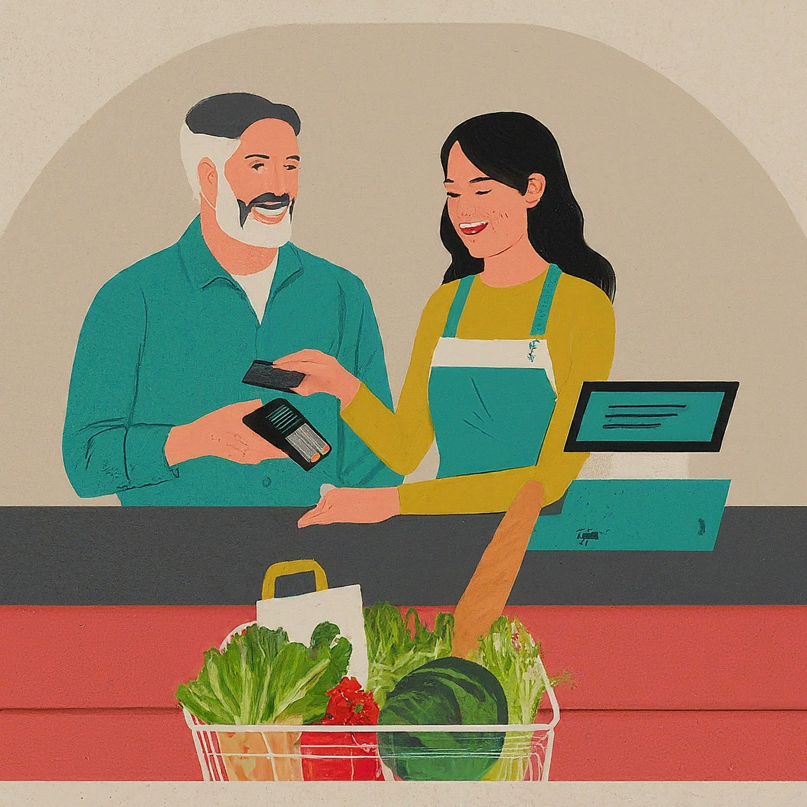

# Payment Industry Concepts

This project will help you understand better how the payments industry works.

  

## Understand the flow of money and the flow of information in the acquiring market and the role of key players

In the acquirer market, which is related to payment processing and acquiring
services, there are several players involved, each with specific roles in both
the money flow and information flow. Let's discuss the main players and their
roles:

**Cardholder:** The cardholder is an individual or business that holds a payment
card (such as a credit or debit card) issued by a card issuer. The cardholder
uses the card to make purchases at merchant locations.

**Merchant:** The merchant is a business entity that sells goods or services and
accepts payment cards as a form of payment. The merchant enters into an
agreement with an acquirer to accept card payments.

**Acquirer:** The acquirer, also known as the acquiring bank or merchant bank,
is a financial institution that partners with merchants to process their card
transactions. The acquirer provides the necessary infrastructure, such as
payment terminals, to enable merchants to accept card payments. The acquirer is
responsible for collecting transaction details from the merchant and routing
them to the appropriate payment networks.

**Payment Networks:** Payment networks, such as Visa, Mastercard, American
Express, and Discover, act as intermediaries between the acquirer and the card
issuer. They provide the network infrastructure and rules for authorizing and
settling card transactions. When a cardholder makes a purchase, the payment
network verifies the transaction details and communicates with the card issuer
to authorize or decline the transaction.

**Card Issuer:** The card issuer is a financial institution, such as a bank or
credit union, that issues payment cards to cardholders. When a cardholder makes
a purchase, the card issuer is responsible for approving or declining the
transaction based on factors like available funds, credit limit, and fraud
detection. If the transaction is approved, the card issuer transfers the funds
to the acquirer.

---

# Now, let's understand the money flow and information flow in the acquirer market
 

### Money Flow:

1. When a cardholder makes a purchase at a merchant location using a payment
   card, the merchant submits the transaction details to the acquirer for
   processing.

2. The acquirer receives the transaction details and routes them to the
   appropriate payment network based on the card brand (Visa, Mastercard, etc.)
   used by the cardholder.

3. The payment network verifies the transaction details and communicates with
   the card issuer to authorize or decline the transaction.

4. If the transaction is approved, the card issuer transfers the funds to the
   acquirer. The acquirer deducts its fees for processing the transaction and
   transfers the remaining funds to the merchant's bank account.

5. The cardholder's card issuer bills the cardholder for the transaction amount,
   and the cardholder settles the payment to the card issuer as per their credit
   card agreement.

### Information Flow:

1. The merchant collects transaction details, such as the transaction amount,
   card number, and merchant ID, and submits them to the acquirer for
   processing.

2. The acquirer encrypts and securely transmits the transaction details to the
   payment network.

3. The payment network verifies the transaction details, performs fraud checks,
   and communicates with the card issuer to authorize or decline the
   transaction. The payment network also captures additional data for reporting
   and analytics purposes.

4. The authorization response, whether approved or declined, is sent back from
   the payment network to the acquirer.

5. The acquirer relays the authorization response to the merchant, allowing them
   to complete the transaction and provide the goods or services to the
   cardholder.

Overall, the acquirer plays a crucial role in facilitating the payment process
between the cardholder, merchant, payment networks, and card issuers. They help to
ensure the smooth flow of funds and information to enable secure and efficient
card transactions.

---

### Additional Details

**Fees:**

Each player in the acquirer market charges fees for their services. Merchants
pay processing fees to acquirers, who may also charge additional fees like
monthly charges or gateway fees. Card networks and issuers have their own fee
structures.

**Security:**

Secure communication protocols and data encryption are used throughout the
process to protect sensitive information. Regulations: Regulations like PCI DSS
govern data security standards in the payment industry.

---

## See the difference between acquirer, sub-acquirer and payment gateway and how the flow explained in question 1 changes for these players
  

## More about the diferences

Here a sngle explanation of the differences between acquirers, sub-acquirers,
and payment gateways, and how the flow changes for each player:

**Acquirer:**

- Think of an acquirer as the financial institution that **ultimately settles**
  the payment between the merchant and the customer's issuing bank.
- They handle tasks like:
  - **Authorizing payments:** Verifying the c*# ***ustomer has sufficient funds and
    approving the transaction.
  - **Settlement:** Transferring funds from the issuing bank to the merchant's
    account (minus fees).
  - **Chargeback processing:** Handling disputes and refunds.
- **Example:** Major banks like Bank of America or Chase.

Read more about Acquirer's [money and information flow](docs/acquarer.md).

**Sub-acquirer:**

- A sub-acquirer acts as an **intermediary** between the merchant and the main
  acquirer.
- They offer similar services to acquirers, but often focus on **high-risk
  industries** or small merchants who might not qualify for direct acquiring
  relationships.
- They **partner with an acquirer** who handles the final settlement and takes
  on most of the financial risk.
- **Example:** Payment processors like Stripe or PayPal.

Read more about [money and information flow](docs/sub_acquirer.md) for the Sub Acquirer.

**Payment Gateway:**

- The payment gateway **facilitates the transaction** but doesn't handle the
  actual settlement.
- It **encrypts customer data**, routes it to the relevant parties (acquirer,
  issuer), and handles communication between them.
- It may also offer additional features like fraud prevention and tokenization.
- **Example:** Payment service providers like Braintree or Adyen.

Read more about [money and information flow](docs/payment_gateway.md) for the  payment gateway.

**Flow Changes:**

- **Merchant (Customer pays) -> Payment Gateway -> Acquirer (Sub-acquirer)**
  - In the standard flow, the customer pays through the merchant's website or
    app, which uses a payment gateway to securely send the payment details to
    the acquirer.
  - With a sub-acquirer, the gateway would route the information to the
    sub-acquirer first, who then forwards it to the main acquirer for
    settlement.
- **Acquirer (Sub-acquirer) -> Issuing Bank -> Merchant (Funds received)**
  - Upon approval, the funds flow back through the same chain, with the acquirer
    (or sub-acquirer) crediting the merchant's account after deducting fees.

**Key Differences:**

| Feature       | Acquirer        | Sub-acquirer     | Payment Gateway         |
| ------------- | --------------- | ---------------- | ----------------------- |
| Main role     | Settle payments | Intermediate     | Facilitate transactions |
| Risk          | High            | Lower (shared)   | No financial risk       |
| Fees          | Lower           | Higher           | Variable fees           |
| Target market | All merchants   | High-risk, small | All merchants           |

I hope this explanation clarifies the distinctions between these players and how
they impact the payment flow.

---

 
**Chargebacks:**
 
A chargeback is a reversal of a transaction initiated by the
cardholder or the cardholder's bank. 
It allows the cardholder to dispute a
transaction and request a refund from their bank. 
Chargebacks are typically used
as a consumer protection mechanism to address issues such as unauthorized
transactions, defective goods, or non-delivery of goods or services. 

*Process:*

When a cardholder initiates a chargeback, the funds for the disputed transaction
are temporarily debited from the merchant's account and returned to the
cardholder. The merchant is typically required to provide evidence to dispute
the chargeback, and the acquiring bank facilitates the resolution process
between the merchant, the cardholder's bank, and the payment network.

**Cancellations:**

Cancellations refer to the act of voiding a transaction before it
is fully processed or settled. Cancellations can occur for various reasons, such
as when a customer changes their mind, the merchant cannot fulfill the order, or
there is a technical issue during the transaction process. 

*Process:*

 When a
cancellation occurs, the transaction is typically voided before settlement, and
no funds are transferred between the cardholder and the merchant. 
The
cancellation process is usually handled within the merchant's system or through
the payment gateway. 

**Difference between Chargebacks and Cancellations:**

> The main difference between chargebacks and cancellations is the stage at which they occur in the transaction process:

Chargebacks occur after the transaction has been processed and settled, and the
cardholder disputes the transaction with their bank. Chargebacks involve a
formal dispute resolution process and can result in funds being returned to the
cardholder.

Cancellations occur before the transaction is fully processed or settled,
typically when the transaction is still in progress or has not yet been settled.

Cancellations do not involve a dispute resolution process since no funds have
been transferred.

Connection with Fraud: Chargebacks are closely connected to fraud in the
acquiring world due to the potential misuse of the chargeback process by
dishonest individuals. Fraudulent chargebacks, also known as friendly fraud,
occur when a cardholder intentionally disputes a legitimate transaction with the
aim of obtaining a refund while retaining the purchased goods or services.

Fraudulent chargebacks can have significant financial implications for merchants
and acquirers, as they may result in the loss of revenue, chargeback fees, and
damage to the merchant's reputation. 

Merchants and acquirers employ various
measures, such as fraud detection systems and robust dispute resolution
processes, to mitigate the impact of fraudulent chargebacks.

It's important to note that not all chargebacks are fraudulent. 

Legitimate chargebacks serve as a vital consumer protection mechanism, allowing cardholders
to seek refunds for unauthorized or problematic transactions. However, the
connection between chargebacks and fraud highlights the importance of effective
fraud prevention and dispute resolution practices in the acquiring world.
